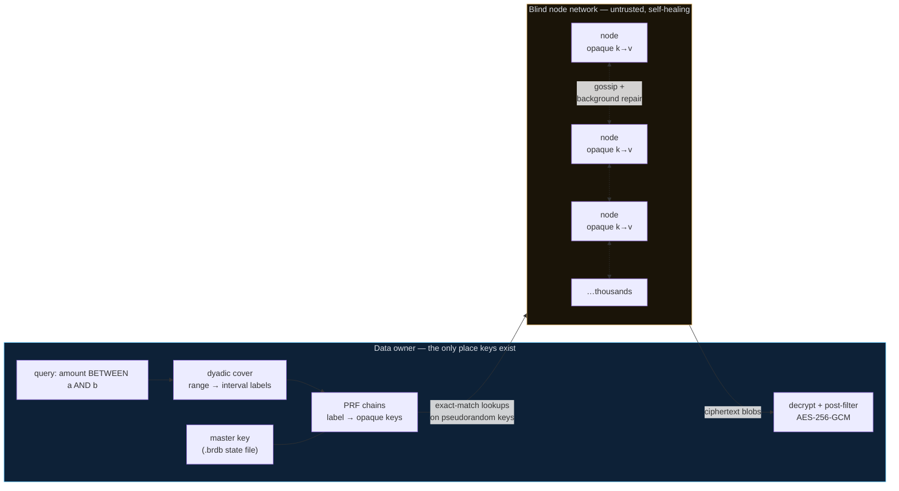

# blindrange

[](https://github.com/alviso/blindrange/actions/workflows/ci.yml)
[](LICENSE)
[](pyproject.toml)
[](#threat-model--measured-not-asserted)

Range queries over encrypted data stored on **blind, decentralized nodes**.

A key-holding owner, an arbitrary number of small storage nodes that hold only
opaque `key → blob` pairs, and dyadic-interval cryptography in between. Nodes
never hold a key, never see plaintext, never evaluate a comparison, and never
learn an ordering. The network has **no central infrastructure and no single
point of failure**: membership is gossip-discovered, and joining — as a node or
as a client — requires only the address of any one live peer.

`WHERE amount BETWEEN 250 AND 500`, `WHERE date BETWEEN x AND y`,
`WHERE name LIKE 'sa%'` — on data the machines answering the query physically
cannot read.

**Project stance: full-honesty leakage disclosure.** Every scheme that makes
encrypted data queryable leaks *something*. This project measures its own
leakage with real attacks against ground truth ([prototype/](prototype/)),
publishes the numbers, and gives you structural dials to bound them. You judge
whether the profile fits your risk tolerance. It is **not** appropriate for
healthcare data or high-stakes PII; it is aimed at ordinary business data on
infrastructure you don't fully trust.

## How it works



The nodes never hold a key, never see plaintext, never evaluate a comparison,
never learn an ordering. Everything on the right side of that boundary is
opaque `key → blob` storage plus gossip — which is why nodes can be run by
anyone.

Server-side `ORDER BY` fundamentally requires the server to see order — and
order leakage is what broke Order-Preserving Encryption (see the attack
literature below). But a range *filter* does not need order: it reduces to
**equality lookups** via dyadic decomposition. Each value is indexed under its
~log₂(domain) dyadic intervals; a query `[a,b]` becomes a minimal cover of
interval labels; the network answers exact-match fetches of pseudorandom keys.

Three design decisions do the heavy lifting:

1. **The owner walks the index, not the nodes.** Each dyadic label keeps a
   client-side counter `c`; entry *i* lives at `PRF(K_label, i)` with the
   record id masked by a second PRF stream. Nodes receive only derived keys —
   never a label key — so at rest the entire network holds unlinkable
   pseudorandom pairs: **no equality, no order, no co-occurrence, and forward
   privacy** (nothing a node has ever seen lets it recognize a future insert).
   This is Sophos-style forward privacy at HMAC speed — the public-key
   trapdoor is only needed when an untrusted *server* walks the chain
   (kept for reference in [prototype/fp_demo.py](prototype/fp_demo.py)).
2. **Leaf width is a structural privacy budget.** Each field's index tree is
   depth-capped so leaves are `leaf_width` wide. The owner always fetches whole
   buckets and filters after decryption, so *no observer — even watching every
   query forever — resolves a value finer than the leaf* (measured in
   [prototype/bounded_demo.py](prototype/bounded_demo.py)). Set it per field at
   schema time; it cannot be overspent later, because finer tags don't exist.
3. **Placement is a consistent-hash ring over gossip membership.** Virtual
   nodes keep any number of nodes evenly loaded; replication (default 3) plus
   read-failover, extended ring probing, and read-repair keep data reachable
   through node death, joins, and churn. Payloads are AES-256-GCM; strings
   index via a 5-bit/char prefix encoding so alphanumeric ranges and `LIKE
   'x%'` are integer ranges.

## Quickstart

```bash
pip install -e .
```

Start a network — each node is one process, one directory, one port. The first
node starts a new network; everyone else seeds off any live peer:

```bash
blindrange-node --port 7501 --data ~/.blindrange/n1 --secret <network-secret>
blindrange-node --port 7502 --data ~/.blindrange/n2 --seed 127.0.0.1:7501 --secret <network-secret>
blindrange-node --port 7503 --data ~/.blindrange/n3 --seed 127.0.0.1:7502 --secret <network-secret>
# ... as many as you like, on as many machines as you like
```

The `--secret` (or `BLINDRANGE_SECRET` env var) is a **network-membership
credential**: every request is HMAC-signed with it, so outsiders can't write,
delete, or probe your network. Be clear about what it is *not*: every node and
client holds it, so it does nothing against a curious or malicious node —
confidentiality never depends on it (that's the cryptography's job), and it is
not transport encryption (run inside TLS/VPN/Tailscale for that). Omit it for
an open playground network.

Every node also has an **identity**: an Ed25519 keypair generated on first
start (kept in its data directory). Gossip heartbeats ("I am at addr X at
time T") are signed by the node itself and verified by everyone who stores or
relays them, so no insider can forge another node's liveness or hijack its
traffic by advertising a wrong address. Placement hashes node *ids*, not
addresses — a node can move (DHCP, new network) without reshuffling data.
This is not Sybil resistance: anyone with the network secret can mint
identities.

Nodes are **self-healing**: each continuously walks its own keys in small
batches (tunable via `BR_REPAIR_EVERY` / `BR_REPAIR_BATCH`) and re-pushes
them to each key's current replica set — so data migrates to newly joined
nodes and replication recovers after churn with no owner involvement. The
e2e suite proves the full arc: data written to a two-node network migrates
to a third node that joined later, and survives both original nodes dying.

### Running nodes on multiple machines

Bind to the LAN and advertise a reachable address:

```bash
# machine A (192.168.1.10) — starts the network
blindrange-node --port 7501 --data ~/.blindrange/n1 \
    --host 0.0.0.0 --advertise 192.168.1.10:7501 --secret <network-secret>

# machine B — joins via any live peer
blindrange-node --port 7501 --data ~/.blindrange/n1 \
    --host 0.0.0.0 --advertise 192.168.1.20:7501 \
    --seed 192.168.1.10:7501 --secret <network-secret>
```

Clients bootstrap the same way: `bootstrap=["192.168.1.10:7501"]`. Nodes
behind NAT need a reachable address — today that means a LAN, a VPN, or an
overlay like Tailscale/Headscale; native NAT traversal is on the roadmap.

Own a database (the only place keys ever exist):

```python
from blindrange import Owner

schema = {
    "amount": {"type": "int", "bits": 20, "leaf_width": 256},  # privacy budget
    "day":    {"type": "int", "bits": 11, "leaf_width": 1},
    "name":   {"type": "str", "bits": 20, "leaf_width": 16, "chars": 4},
}
owner = Owner.create("my.brdb", "passphrase", schema,
                     bootstrap=["127.0.0.1:7501"])   # any one live node
owner.insert_many([{"amount": 34999, "day": 512, "name": "acme corp"}, ...])

owner.query("amount", 25000, 50000)      # BETWEEN, decrypted only here
owner.query_prefix("name", "ac")         # LIKE 'ac%'
owner.query_multi([                      # AND of predicates: record-id sets
    {"field": "amount", "lo": 25000, "hi": 50000},   # intersect BEFORE any
    {"field": "day", "lo": 100, "hi": 400}])         # ciphertext is fetched

rid = owner.query("amount", 25000, 50000)[0]["_rid"]
owner.delete(rid)                        # tombstone + ciphertext removal
owner.compact()                          # epoch rewrite: merges all writers'
                                         # chains, drops tombstoned entries
                                         # (real forgetting); SAFE under
                                         # concurrent writes (open/drain/seal)
owner.repair()                           # full owner-driven anti-entropy pass
                                         # (nodes also heal continuously
                                         # among themselves)
```

`my.brdb` is a passphrase-encrypted state file (master key + writer identity +
counter caches). Reopen anywhere with `Owner.open("my.brdb", "passphrase")`.

**Multiple writers, no coordination.** The index is per-(label, writer)
append-only chains — a grow-only CRDT: writers never contend, views merge by
union, offline writers just append when they reconnect. Onboard a second
writer with an invite (a secret string — it contains the master key):

```python
invite = owner.invite()                       # transmit securely, then discard
other  = Owner.accept("their.brdb", "their pass", invite)
```

There is no sync protocol to run: entry keys are deterministic, so readers
discover other writers' chain lengths by **galloping probes** against the
network itself (exponential-then-binary, batched), and writers announce
themselves once in an encrypted on-network registry appended lock-free via
insert-if-absent. Counters — even your own — are treated as a cache and a
lower bound: a client with a stale or empty cache reconstructs everything by
probing, so the state file is not a correctness-critical single point of
failure. Only the master key is unrecoverable.

## The sample application

```bash
python3 examples/webdemo/app.py        # http://127.0.0.1:8600
```

A self-contained demo: spawns 8 local blind nodes, seeds 1,000 encrypted
customer orders, and serves a three-panel UI — **owner view** (run amount/date
ranges and customer-prefix queries, watch decrypted results with per-query
stats: cover intervals, opaque index lookups, over-fetch filtered client-side),
**network view** (gossip-discovered nodes with kill/spawn buttons — kill two
mid-demo and queries keep answering), and **node view** (a live `/intel` dump of
what a node operator actually sees: opaque keys, opaque blobs, nothing else).
Use `--bootstrap host:port` to point the same app at a real network instead.

## Testing

```bash
python3 -m unittest tests.test_e2e -v
```

CI runs the suite on every push (GitHub Actions, Python 3.11 and 3.13).
Seventeen end-to-end tests against real gossip networks: membership
discovery, int/prefix query correctness vs plaintext ground truth, node death,
node join with read-repair, owner reopen from the encrypted state file,
wrong-passphrase rejection, two writers reading each other's data with
interleaved same-value inserts, full recovery from an empty counter cache,
two-field AND queries, deletes visible to fresh clients via tombstones, and
compaction (correctness preserved, tombstoned entries dropped, late writers
picking up the new epoch), rejection of unauthenticated requests, the
owner-driven repair sweep, hot-label striping across nodes, a writer
inserting concurrently with a running compaction, and gossip-driven
node-to-node data migration surviving the death of all original holders.

## Threat model — measured, not asserted

The adversary is the network itself: **all nodes colluding**, honest-but-
curious, keyless. The numbers below come from running real attacks in
[prototype/attack.py](prototype/attack.py) against plaintext ground truth
(3,000 records, realistic skewed distribution). Reproduce them yourself.

**Guaranteed:** payload confidentiality (AES-256-GCM, keys never leave the
owner) and, with the counter-chain index, **zero structure at rest** — a
snapshot of every disk in the network is unlinkable pseudorandom pairs.

**What queries leak, and the dials that bound it:**

- Serving a query reveals which (bucket-level) index keys were touched and
  which ciphertexts were fetched — the **access pattern**. A patient observer
  correlating many queries can localize records *up to the leaf width, never
  finer*: with uncapped leaves a strong reconstructor reached 94% exact value
  recovery after 120 observed queries; with `leaf_width` W its error is pinned
  at ~W/4 **forever** ([prototype/bounded_demo.py](prototype/bounded_demo.py)).
- Result volumes leak counts per queried bucket; on skewed columns with public
  reference distributions this admits frequency inference (measured: ~12yr MAE
  on skewed ages — and near-random on uniform columns). Padding and coarser
  leaves both blunt it (measured in [prototype/attack.py](prototype/attack.py)).
- Records fetched together are known to co-occur in some queried range —
  accumulating equality/grouping information about *queried* data over time.

**Rules of thumb:** don't index what you never range-query; set `leaf_width` to
the coarsest granularity your queries can live with; know that unqueried data
reveals nothing at all.

## Honest limitations (v0.1)

- Deletes are tombstone-then-compact: between a delete and the next
  `compact()`, index entries for the deleted record still exist (they resolve
  to nothing — the ciphertext is removed immediately — but a node that
  correlates old fetches could notice which entries went dead). Full backward
  privacy holds only after compaction.
- `compact()` is safe under concurrent writes via the open/drain/seal epoch
  protocol (readers consult both epochs mid-compaction; the drain re-walks
  the old epoch until stable). The residual edge: a write that checked the
  epoch *before* the open marker and then takes longer to land than a full
  drain pass could in principle be missed — the stability requirement makes
  this window effectively zero, but it is not cryptographically closed
  (write-intent leases would close it; future work). One compactor at a
  time, enforced by an insert-if-absent epoch slot.
- Read-repair heals what queries touch; `owner.repair()` sweeps everything
  else, but it is owner-driven — nodes do not yet repair among themselves.
- The network secret is shared membership auth (anti-vandalism), not
  per-node identity, and transport is plaintext HTTP — run inside
  TLS/VPN/Tailscale. The *confidentiality* model never depends on either:
  nodes are untrusted by construction.
- A malicious (not just curious) node can drop or serve stale blobs — AES-GCM
  makes forgery detectable, but availability attacks are only mitigated by
  replication, not proven impossible.
- Multiple writers are supported (per-writer chains, no coordination), but one
  writer *id* should have one live instance at a time: two devices sharing a
  copied state file are safe sequentially (queries re-probe own chains), not
  concurrently. Give each device its own invite instead.
- Read fan-out grows with the number of writers that touched a label since the
  last compaction, and every query spends a few galloping probes per
  (label, writer). `compact()` collapses all streams back to one per label.
- Under simultaneous first-time writer registrations, the registry append
  retries via insert-if-absent; a pathological race combined with the loss of
  a slot's primary replica could hide a writer id until re-registration —
  writer onboarding is rare and owner-driven, but know the edge exists.
- Hot labels do NOT concentrate on single nodes: every chain entry is its own
  PRF-derived key, so a popular value's entries stripe across the whole ring
  (verified in the e2e suite). What a hot label does cost is enumeration
  (reading a long chain at query time) — proportional to result size, and
  collapsed by compaction.
- Losing the master key loses the database; losing the rest of the state file
  costs only a re-probe. Back the key up accordingly.

## The research trail (`prototype/`)

The measured prototypes this package grew from, kept runnable on purpose —
they are the evidence for every claim above: the base scheme and its 10-node
demo, the honest-but-curious node, the attack harness (equality recovery,
frequency inference, ML range reconstruction, mitigation measurements), the
RSA/Sophos forward-privacy reference, the consistent-hashing failover demo, and
the structural-privacy-budget measurement.

Prior art: dyadic/structured-encryption ranges (Faber et al.; Demertzis et al.;
Kamara–Moataz; MongoDB Queryable Encryption), attacks (Naveed–Kamara–Wright
CCS'15; Grubbs et al. S&P'17/'19; Kellaris et al. CCS'16), forward privacy
(Stefanov–Papamanthou–Shi; Bost's Σoφoς).

## License

MIT
